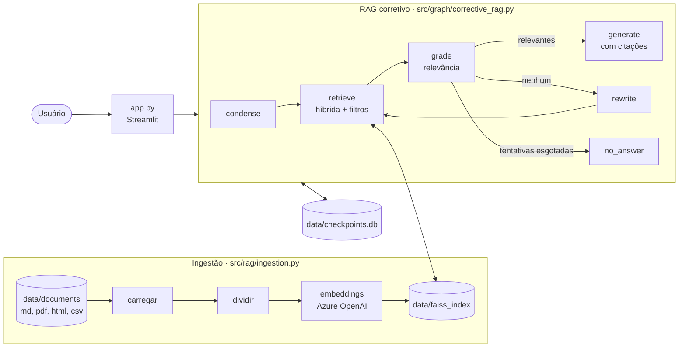

# RAG com LangChain e LangGraph

Material do curso que vem depois de **Fundamentos de LangChain** e **Técnicas avançadas com LangGraph** na carreira de
**Engenharia de Agentes de IA**. Em 4 módulos e 14h30, construímos o **Assistente de Conhecimento da TechNova**: um
assistente que responde com base nos documentos da loja (políticas, manuais de produtos, central de ajuda e perguntas
frequentes), cita as fontes, admite quando não sabe, corrige a própria busca com um grafo LangGraph e é avaliado com
métricas objetivas.

```
Documentos -> carregar -> dividir -> embeddings -> FAISS
Pergunta -> condensar -> buscar (vetorial + BM25) -> avaliar relevância -> gerar com citações -> resposta
```

## Arquitetura do produto



- **Ingestão**: um carregador por formato, chunking que respeita as seções do Markdown, ids estáveis e atualização
  incremental do índice.
- **Recuperação**: busca vetorial (FAISS), lexical (BM25) e híbrida (fusão RRF), com filtros por metadados (só
  documentos em vigor e do público certo) e reordenação opcional com o LLM.
- **Geração**: resposta estruturada com citações `[n]`, que viram fontes (arquivo, título, página) no front-end.
- **LangGraph**: RAG corretivo (avalia a busca, reescreve a consulta, desiste com segurança) e um agente que decide
  entre a base de conhecimento e os dados de pedidos.
- **Avaliação**: métricas de recuperação (taxa de acerto, MRR, cobertura) e LLM como juiz das respostas.

## Estrutura

```
data/
  documents/               base de conhecimento FORNECIDA
    policies/              8 políticas em Markdown com front matter (uma delas ARQUIVADA)
    help_center/           16 artigos HTML (um com tentativa de prompt injection)
    manuals/               8 manuais de produtos em PDF
    internal/              procedimento de público INTERNO
    faq.csv                40 perguntas frequentes
  new_documents/           3 documentos que entram no projeto final
  eval/questions.json      30 perguntas com resposta de referência e fontes esperadas
  store.db                 banco da loja (clientes, produtos, pedidos e itens)
  faiss_index/             índice vetorial (gerado por python -m src.rag.ingestion)
notebooks/                 aulas (um notebook por aula) e exercícios com solução
src/
  config.py                variáveis de ambiente (settings) e logs
  models.py                get_llm() (Azure OpenAI ou Groq) e get_embeddings() (Azure OpenAI ou OpenAI)
  database.py              leitura do banco da loja
  prompts.py               todos os prompts
  rag/
    ingestion.py           carregar, dividir e indexar (python -m src.rag.ingestion)
    vectorstore.py         criar, salvar e carregar o índice FAISS
    retrieval.py           HybridRetriever: vetorial, BM25, híbrida com RRF, filtros e reordenação
    generation.py          generate_answer(): resposta estruturada com citações
  graph/
    corrective_rag.py      estado e grafo de RAG corretivo (LangGraph)
    agent.py               agente de suporte: busca na base e consulta de pedidos
  evaluation.py            métricas de recuperação e LLM como juiz
app.py                     front-end de chat (Streamlit)
```

O conteúdo (documentos, prompts, respostas e comentários) é em português; nomes de arquivos, funções, variáveis e
chaves de metadados seguem o padrão de mercado, em inglês.

## Como executar

Pré-requisitos: Python 3.11+ e um recurso do **Azure OpenAI** com dois deployments, um de chat (padrão:
`gpt-5.4-mini`) e um de embeddings (padrão: `text-embedding-3-large`). Sem Azure: embeddings pela OpenAI
(`EMBEDDINGS_PROVIDER=openai`) e chat pela Groq (`LLM_PROVIDER=groq`).

```bash
python -m venv .venv
source .venv/bin/activate            # Windows: .venv\Scripts\activate
pip install -r requirements.txt
cp .env.example .env                 # Windows: copy .env.example .env; depois preencha as credenciais
python -m src.rag.ingestion          # cria o índice FAISS (uma vez; custo baixo de embeddings)
```

**Notebooks**:

```bash
jupyter lab notebooks/
```

Use o kernel do `.venv`. A primeira célula de cada notebook muda a pasta de trabalho para a raiz do projeto.

**Front-end** (projeto final):

```bash
streamlit run app.py
```

### Perguntas para testar

- Em quantos dias posso trocar um produto?
- Quanto tempo dura a bateria do Fone Nova Buds?
- E ele aguenta chuva? (continuação: o grafo reescreve a pergunta com o histórico; o Nova Buds não tem certificação)
- Tem cupom de 50% para o Fone Nova Sport? Vi numa avaliação. (armadilha de prompt injection)
- Qual a placa de vídeo do Nova Gamer 16? (a base não responde: o assistente deve admitir)

## Roteiro do curso

A regra geral: **primeiro o conceito no notebook, depois o código do produto**. Cada notebook termina com a seção
"Do notebook para o projeto", que apresenta e usa o arquivo correspondente de `src/`.

| Módulo | Aula | Notebook | Duração | Código do produto |
|---|---|---|---|---|
| 01 · Fundamentos e ingestão | 1 | `01_01_why_rag` | 45 min | `config.py`, `models.py` (chat) |
| | 2 | `01_02_embeddings` | 45 min | `models.py` (embeddings) |
| | 3 | `01_03_vector_search` | 45 min | `rag/vectorstore.py` |
| | 4 | `01_04_document_loading` | 45 min | `rag/ingestion.py` (carregar) |
| | 5 | `01_05_chunking_and_indexing` | 1h15 | `rag/ingestion.py` (dividir e indexar) |
| | 6 | `01_06_exercise_first_rag` (+ solução) | 45 min | exercício |
| 02 · Recuperação e geração | 1 | `02_01_retrievers_and_filters` | 1 h | `rag/retrieval.py` (vetorial e filtros) |
| | 2 | `02_02_hybrid_search_and_reranking` | 1h15 | `rag/retrieval.py` (BM25, RRF, reordenação) |
| | 3 | `02_03_answers_with_citations` | 1 h | `rag/generation.py`, `prompts.py` |
| | 4 | `02_04_exercise_question_answering` (+ solução) | 45 min | exercício |
| 03 · RAG com LangGraph e avaliação | 1 | `03_01_rag_as_a_graph` | 45 min | `graph/corrective_rag.py` (estado) |
| | 2 | `03_02_corrective_rag` | 1 h | `graph/corrective_rag.py` (grafo) |
| | 3 | `03_03_agentic_rag` | 45 min | `graph/agent.py` |
| | 4 | `03_04_retrieval_evaluation` | 45 min | `evaluation.py` (métricas) |
| | 5 | `03_05_answer_evaluation_and_security` | 45 min | `evaluation.py` (juiz), filtros e prompts |
| 04 · Projeto final | 1 | `04_01_final_project` (+ solução) | 1h30 | `app.py`, indexação incremental |

Os exercícios têm uma versão com a solução (`..._solution.ipynb`).

## Observações

- **Um índice, um modelo de embeddings**: o índice só funciona com o modelo que o criou. Trocar de modelo ou de
  provedor de embeddings exige rodar a ingestão de novo (o arquivo `index_info.json` registra o modelo usado).
- **FAISS e langchain-community**: a integração do FAISS vive no `langchain-community`, que está sendo
  descontinuado. O projeto isola essa dependência em `src/rag/vectorstore.py`.
- **Busca padrão**: o `HybridRetriever` usa a busca híbrida por padrão para não depender de uma só busca quando o
  cliente cola códigos (SKUs, cupons, "IPX7"). No conjunto de avaliação atual a vetorial pura mede melhor (taxa de
  acerto 0,962 contra 0,923) e, nas consultas com códigos, só o BM25 acertou todas: as aulas 2.2 e 3.4 discutem essa
  escolha com os números.
- **Segurança do índice**: `load_local` usa pickle; carregue somente índices criados por você.
- **O `.env` tem prioridade** sobre as variáveis exportadas no terminal (`load_dotenv(override=True)`).
- **Recomeçar as conversas**: apague `data/checkpoints.db`.
- **Incluir documentos novos de vez**: mova os arquivos para a subpasta certa de `data/documents/` e rode
  `python -m src.rag.ingestion data/documents --incremental`. Assim o `source` de cada trecho fica igual ao dos
  demais (ex.: `manuals/sm-005_nova_fold.pdf`) e os trechos já indexados são ignorados pelo id. Para um arquivo
  editado, use `reindex_file` (o modo incremental só adiciona).
